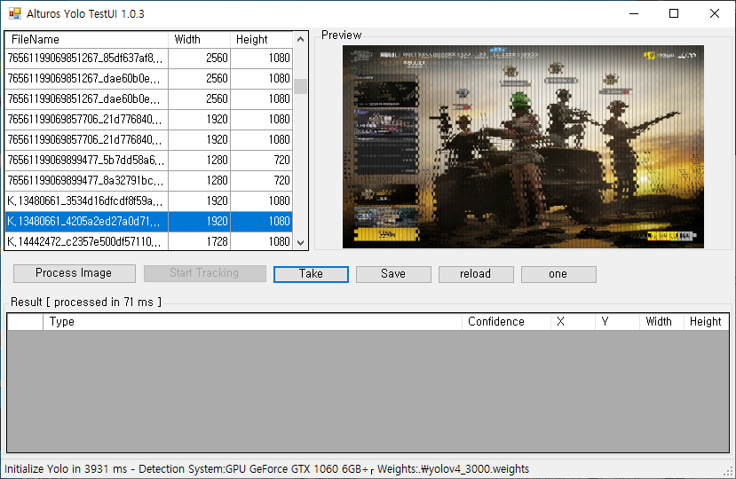

# Window 환경에서 C# Yolo 객체인식 프로그램

이 프로그램은 https://github.com/AlturosDestinations/Alturos.Yolo/tree/master/src/Alturos.Yolo.TestUI 을 참고하여 만들었습니다.



```
- Process Image 버튼을 이용하여 선택한 사진의 객체인식
- Start Tracking 버튼을 이용하여 연속적으로 객체인식을 하여 감지 되었을경우 txt에 정보를 기록합니다. 
(학습된 weights파일을 이용하여 사진을 분류할 수 있음)
- Take 버튼을 이용하여 사용자의 전체화면을 캡처
- Save 버튼을 이용하여 캡처한 화면 저장
- reload 버튼을 이용하여 파일목록을 리셋
- one 버튼을 이용하여 사용자의 화면을 캡처하여 객체인식 실행
```

## NuGet
Quick install Alturos.Yolo over [NuGet](https://www.nuget.org/packages/Alturos.Yolo)
```
PM> install-package Alturos.Yolo (C# wrapper and C++ dlls 28MB)
PM> install-package Alturos.YoloV2TinyVocData (YOLOv2-tiny Pre-Trained Dataset 56MB)
```

## Performance
한장당
GPU를 사용하며 50 - 100ms의 시간이 걸립니다.
GPU를 사용하지 않고 CPU 사용시 1100 - 1800ms의
## System requirements
- .NET Framework 4.6.1 or .NET standard 2.0
- [Microsoft Visual C++ Redistributable for Visual Studio 2015, 2017 und 2019 x64](https://aka.ms/vs/16/release/vc_redist.x64.exe)

### GPU requirements
`10.2`버전을 사용하지 않으면 실행이 안됩니다.

1) 최신버전 Nvidia 그래픽 드라이버 설치
2) [Nvidia CUDA Toolkit 10.2 설치](https://developer.nvidia.com/cuda-downloads)
3) [Nvidia cuDNN v7.6.5 for CUDA 10.2 설치](https://developer.nvidia.com/rdp/cudnn-download)
4) `cudnn64_7.dll`을 프로젝트 빌드 후 생긴 '\src\Alturos.Yolo.TestUI\bin\Debug' 경로로 복사

## Build requirements
- Visual Studio 2019

### CPU

Processor | YOLOv2-tiny | YOLOv3 | yolo9000 |
--- | --- | --- | --- | 
Intel i7 3770 | 260 ms | 2200 ms | - | 
Intel Xeon E5-1620 v3 | 207 ms | 4327 ms | - | 
Intel Xeon E3-1240 v6 | 182 ms | 3213 ms | - | 

### GPU

Graphic card | Single precision | Memory | Slot | YOLOv2-tiny | YOLOv3 | yolo9000 |
--- | --- | --- | --- | --- | --- | --- |
NVIDIA Quadro K420 | 300 GFLOPS | 2 GB | Single | - | - | - |
NVIDIA Quadro K620 | 768 GFLOPS | 2 GB | Single | - | - | - |
NVIDIA Quadro K1200 | 1151 GFLOPS | 4 GB | Single | - | - | - |
NVIDIA Quadro P400 | 599 GFLOPS | 2 GB | Single | - | - | - |
NVIDIA Quadro P600 | 1117 GFLOPS | 2 GB | Single | - | - | - |
NVIDIA Quadro P620 | 1386 GFLOPS | 2 GB | Single | - | - | - |
NVIDIA Quadro P1000 | 1862 GFLOPS | 4 GB | Single | - | - | - |
NVIDIA Quadro P2000 | 3011 GFLOPS | 5 GB | Single | - | - | - |
NVIDIA Quadro P4000 | 5304 GFLOPS | 8 GB | Single | - | - | - |
NVIDIA Quadro P5000 | 8873 GFLOPS | 16 GB | Dual | - | - | - |
NVIDIA GeForce GT 710 | 366 GFLOPS | 2 GB | Single | - | - | - |
NVIDIA GeForce GT 730 | 693 GFLOPS | 2-4 GB | Single | - | - | - |
NVIDIA GeForce GT 1030 | 1098 GFLOPS | 2 GB | Single | 40 ms | 160 ms | - |
NVIDIA GeForce GTX 1060 | 4372 GFLOPS | 6 GB | Dual | 25 ms | 100 ms | - |

### 객체인식 weights

```
직접 학습시킨 파일로 테스트를 하려면 "\src\Alturos.Yolo.TestUI\bin\Debug"의 .names 파일과 .cfg .weights 
파일을 바꿔 실행하면 자신이 학습시킨 weights로 실행이 가능
테스트 시킬 이미지는 "\src\Alturos.Yolo.TestUI\bin\Debug\Images"에 넣어 구분 시킬 수 있음 
최대 2개의 하위 폴더에 있는 이미지를 찾아 리스트로 나타남
```

### Yolo 학습을 위한 코랩
,,,
https://colab.research.google.com/drive/1p5fxSbRIl5HzVNWBBBDCfeMVtR_CDghn?usp=sharing
,,,
